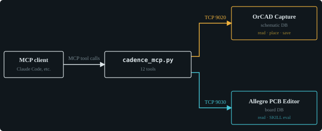

# Cadence-MCP-SPB17

**AI agent control of Cadence OrCAD Schematic Capture and PCB Designer SPB 17.4.**

Design automation for **OrCAD Capture 17.4** and **Allegro PCB Editor 17.4**,
including a working **external control bridge** — an outside process drives
Capture through its first-party text API and reads back real database state.
No screenshots, no GUI scripting. Developed and tested while designing an op-amp
based phono preamplifier.



**Both tools, one MCP server, 12 tools.** Capture supports read, property
modification, part placement and save. Allegro supports read and arbitrary
SKILL evaluation.

## Layout

| Path | Contents |
|---|---|
| `bridge/cadence_mcp.py` | **MCP server — exposes both tools (12 tools)** |
| `bridge/capture_bridge.py` | Client for Capture's TCL Communication Server |
| `bridge/tcl/capBridgeQuery.tcl` | Capture queries + write support |
| `bridge/tcl/capBridgeServer.tcl` | Loopback-only server start (see Security) |
| `bridge/allegro/allegroBridge.il` | Allegro SKILL side — `abStart` / `abStop` |
| `bridge/allegro/allegro_helper.py` | socket ↔ stdio relay, spawned *by* Allegro |
| `bridge/allegro/allegro_client.py` | Allegro client |
| `bridge/allegro/allegroQuery.il` | Structured board queries |
| `bridge/test_bridge.py` | 46 offline protocol tests (no tools needed) |
| `bridge/allegro/place_check.py` | Placement checker — keepin, overlap, creepage, symmetry |
| `bridge/allegro/dangle_check.py` | Finds copper that terminates on nothing |
| `bridge/allegro/route_to_plane.py` | Drops isolated SMD pins onto a plane net |
| `bridge/allegro/silk_check.py` | Silkscreen audit — clutter, text on pads, unlabeled parts |
| `bridge/allegro/layer_view.py` | Show one conductor layer at a time |
| `bridge/allegro/text_view.py` | Hide the component-text blizzard |
| `bridge/allegro/snapshot.py` | Dated board copy, keyed to the git commit |
| `bridge/allegro/board_profile.py` | Loads `board.json` (see below) |
| `docs/allegro_api_notes.md` | **What actually bites on the Allegro side. Read this first.** |
| `docs/capture_api_notes.md` | **The Capture `Dbo*` layer** — wire creation, probe safety, why in-session reads lie |
| `docs/allegro_skill_index.md` | **861 documented `axl*` functions**, by chapter |
| `skill/pcbDrcAudit.il` | Allegro SKILL — DRC audit, triage, net probe |
| `bridge/tcl/capPlaceWire.tcl` | Wire placement from the database layer (see capture notes) |
| `tcl/pcbWorkflows/` | The four Capture audit workflows |
| `tcl/capAutoLoad/` | Menu registration; optional server auto-start |
| `skill/allegro.ilinit` | Auto-load all SKILL tooling at Allegro startup |
| `examples/readback.py` | End-to-end example: dump every part's properties |
| `board.example.json` | Template for the per-board config |

## Design data stays out of this repo

The checkers and routers here are generic — they know how to measure creepage,
find floating copper, drop pins onto a plane. What they cannot know is *which*
nets carry mains, where the mounting holes are, which refdes are a stereo pair,
or where the `.brd` lives. That is design data.

It goes in **`board.json`** at the repo root, which is **gitignored**. Copy
`board.example.json`, fill it in, and the tools work. Without it they refuse to
run rather than silently checking nothing — an unconfigured check reporting
"pass" is worse than no check at all.

Scripts that encode one specific board's geometry — its routing, its BOM, its
project log — belong **with that board**, not here. Keeping the split honest is
what lets this repo be about driving Cadence rather than about any one design.

## Why the two bridges differ

Capture ships a TCP Communication Server, so the client connects to it directly.

SKILL has **no socket support** at all. It does have `ipcBeginProcess`, which
spawns a child process wired to stdin/stdout — so on the Allegro side the
*child* owns the socket and SKILL talks to it over pipes:

```
client ──TCP 9030──▶ allegro_helper.py ──stdout──▶ SKILL data handler
                            ▲                          │ evalstring
                            └──── ipcWriteProcess ──────┘
```

## Quick start

**0. Point the tooling at this repo.** The SKILL side locates its own files
through one environment variable — nothing in the repo hard-codes a path:

```bash
setx CADENCE_PCB_REPO "C:/path/to/Cadence-MCP-SPB17"
```

Use forward slashes, and restart Capture/Allegro afterwards. Only needed for
the Allegro side and the auto-load files.

**1. In Capture's Command Window** (once per session — one line at a time):

```
package require capCommServer
::capCommServer::StartServer
```

**2. In Allegro** — type `skill` at the `Command:` prompt, then:

```
load("<repo>/bridge/allegro/allegroBridge.il")
abStart()
```

**3. From a shell:**

```bash
python bridge/capture_bridge.py status
python bridge/allegro/allegro_client.py "axlDBGetDesign()"
```

**4. As an MCP server:**

```bash
claude mcp add cadence -- python /path/to/bridge/cadence_mcp.py
```

Read-only by default. Pass `--allow-write` to expose
`capture_set_part_property` and `capture_save_design`.

Either tool can be absent or restarted independently — each bridge connects
lazily and reports how to restart the side that is missing.

**5. Run the tests** (needs neither Capture nor Allegro):

```bash
python bridge/test_bridge.py
```

## Python API

```python
from bridge.capture_bridge import CaptureBridge

with CaptureBridge() as cap:
    cap.source_file(".../bridge/tcl/capBridgeQuery.tcl")

    cap.parts()                          # 57 parts as dicts
    cap.connectivity()                   # net -> refdes
    cap.run_workflow("preNetlistCheck")  # full report, as data
    cap.eval("info patchlevel")          # arbitrary TCL inside Capture
```

## ⚠ Security

`::capCommServer::StartServer` binds **all interfaces** — measured
`0.0.0.0:9020` and `[::]:9020`. Dispatch is unrestricted (`$procName $args`,
and `eval` fits the convention), so **any host that can reach port 9020 can
execute arbitrary code as you.** There is no authentication anywhere in the
path. This is Cadence's default, not something introduced here.

`bridge/tcl/capBridgeServer.tcl` starts the same server bound to `127.0.0.1`.
Verify with `netstat -ano | grep 9020`.

Even loopback-only, this is unauthenticated local RPC — any local process can
use it. Reasonable for a design-automation channel, but make it a deliberate
choice, and don't leave it running on an untrusted network.

## Gotchas that cost real debugging time

Full detail in `docs/allegro_api_notes.md`; these are the ones that bite hardest.

**Allegro — one command per line.** Never paste a multi-line block into the
`Command:` prompt. Allegro wraps it as `skill '...'`, quote characters like
`'type` collide with the wrapper, and **only the first line executes with no
error**. Also: `load()` is not valid at `Command:` — use the `Skill>` prompt.

**Bridge protocol.** Requests *and* responses must each be a single line.
A newline in a request truncates it (server never replies → client timeout);
a newline in a response desynchronizes every later reply. Every remote-callable
proc must take **exactly one argument** and should **return** data rather than
`puts` it.

**`info body` is disabled in Capture.** It returns empty for *every* proc,
including ones you just defined and successfully called. It cannot tell you
what code is loaded — test observable behavior instead.

**Look commands up; do not guess them.** Guessing has cost this project six
Capture crashes. Two reliable references:

- `docs/allegro_skill_index.md` — 861 `axl*` functions from the local docs
- **Journaling** — `SetOptionBool Journaling TRUE` + `DisplayCommands TRUE`,
  then perform the action by hand and read the command Capture itself issues.
  This solved `PlacePart` in one attempt after hours of failed inference.

**A documented "quiet" flag does not guarantee no GUI appears.** Three
confirmed cases: `PlacePart` pops an error dialog, `PlaceWire` spins a modal
loop that kills Capture, and `axlReportGenerate('list nil)` blocks the Allegro
bridge despite `nil` meaning "do not show the report". Anything that produces
user-facing output is suspect from a socket.

**But the interactive command is not the only route.** `PlaceWire` really does
kill the app -- and `DboPage_NewWireScalar` creates the same wire from the
database layer with no modal loop at all. See `docs/capture_api_notes.md`.

**What works, and what does not:**

| | Capture | Allegro |
|---|---|---|
| Read anything | ✅ | ✅ |
| Modify properties | ✅ | ✅ |
| Create components | ✅ `PlacePart` | ✅ `axlDBCreateSymbol` |
| **Create traces / wires** | ✅ `DboPage_NewWireScalar` (⛔ not `PlaceWire`) | ✅ `axlDBCreateLine` |
| Transactions + rollback | `StartDBBatchUpdate` / `End`, no rollback | ✅ |
| Create design / page | ✅ | via `netrev -n` |
| Save geometry | ✅ | ✅ `axlSaveDesign(?noConfirm t)` |
| **Save property edits** | ⚠ **needs a human GUI save** | ✅ |
| Set layer colour | — | ⚠ palette RGB only; per-layer index is read-only |
| Export a board image | — | ⚠ `capture image` (canvas grab); SVG export is licence-gated |

The asymmetry is smaller than this project long believed. Capture's *command*
vocabulary is **interactive** — `PlaceWire` drives a modal loop and is fatal
from a socket callback. But its `Dbo*` **database** layer is not: `DboPage_New*`
alone exposes 45 constructors, including `NewWireScalar`, `NewNetScalar`,
`NewPlacedInst`, `NewPort` and `NewJunction`. Wires created that way persist and
carry real connectivity.

An earlier version of this README stated there was "no database-level
alternative" to `PlaceWire`. That was wrong, and it was wrong because the API
had been sampled rather than enumerated — see `docs/capture_api_notes.md`, which
is largely a catalogue of conclusions this project reached from partial views.

The one genuine asymmetry left is durability: Allegro's `axlSaveDesign` persists
everything, while Capture's `DboSession_SaveDesign` persists geometry but **not**
property edits, which still require a human File → Close → Save.

## Working style

Treat every documented API name as a *hypothesis to verify against the live
17.4 install*, not a fact. Several documented calls don't exist, have
different signatures, or crash outright.

And the sharpest lesson from this project: **`catch` with a plausible default
turns API misuse into confident wrong data.** `_getRefDes` returned `"?"` for
every part for months because a two-argument call was made with one argument —
and `"?"` is indistinguishable from a genuinely unannotated part. Three
separate bugs of this shape inflated one audit from 3 real errors to 89.
Prefer defaults that cannot be mistaken for real values.

## Provenance

Built by **Dave** — a hardware EE — working with **Claude Opus**, against a
real, licensed **2019** Cadence installation. Nothing here is a Cadence
product, endorsed by Cadence, or based on anything but the shipped
documentation, the shipped example code, and behaviour observed live.

The tooling was developed against a real design rather than a synthetic one —
a moving-coil phono preamp, 57 parts over two schematic pages. That design's
component-level details are intentionally not published here; they are
irrelevant to the automation and belong to the board, not the repo. Where the
notes reference a second, unrelated board used as a read-only test fixture, it
is described only in the abstract for the same reason.

Every API name in these notes was verified against the live 17.4 install.
Where a documented call turned out not to exist, to have a different
signature, or to crash the application, the notes say so — including the
several occasions where an earlier conclusion in this repo was **wrong and was
later corrected**. Those corrections are left in deliberately. A clean
narrative would be less useful than an honest one.
